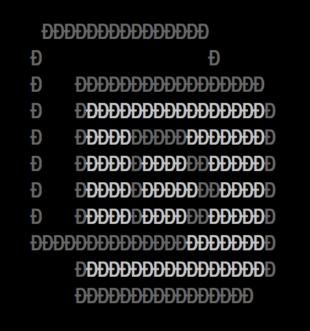

# terminal-logo

Logo for Deck with same interace as nearForm terminal logo https://www.npmjs.com/package/nearform-terminal-logo


"Deck logo" by [Valentin Keleti](https://www.flickr.com/photos/valke04) can be reused under the [CC BY license](https://creativecommons.org/licenses/by/4.0/)


## Usage
logo(_options_);

options - an options object which has two attributes:
- leftPadding: represents left padding in terminal points (monospaced characters). This is optional and by default, the logo is placed in the middle of the terminal.
- text: Text to be displayed beside the logo. This is also optional.

_Note_: `logo()` can be called without any options which will print the logo to the middle of the terminal.


Also has a `toTTY(options)` method, that writes directly to `process.stdout`. 


```javascript
require('deck-terminal-logo').toTTY({leftPadding: 20});
``` 

## Example

```javascript
var logo = require('deck-terminal-logo');
console.log(logo({leftPadding: 20, text: 'DECK'}));
```

## Output




